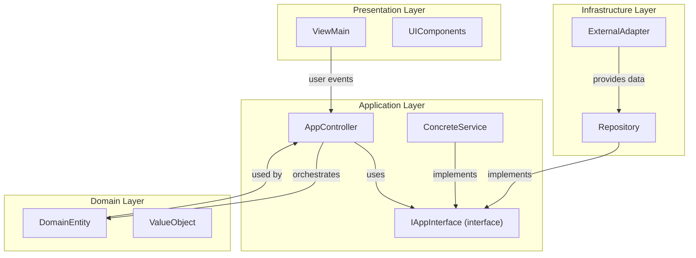
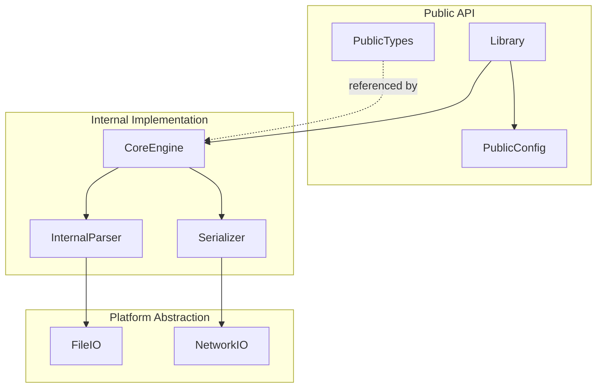
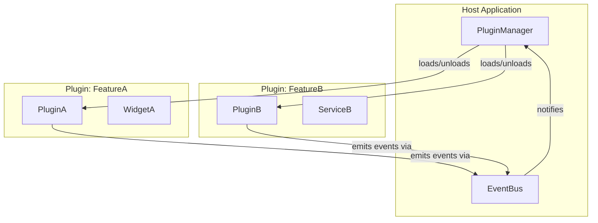
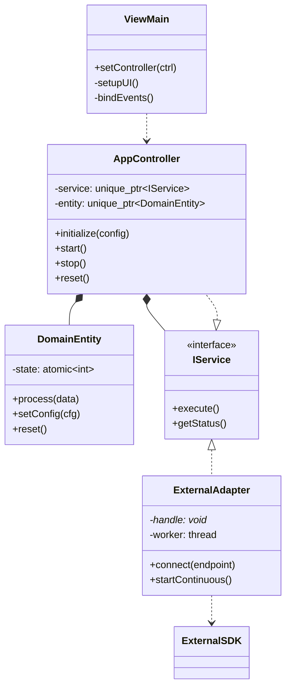
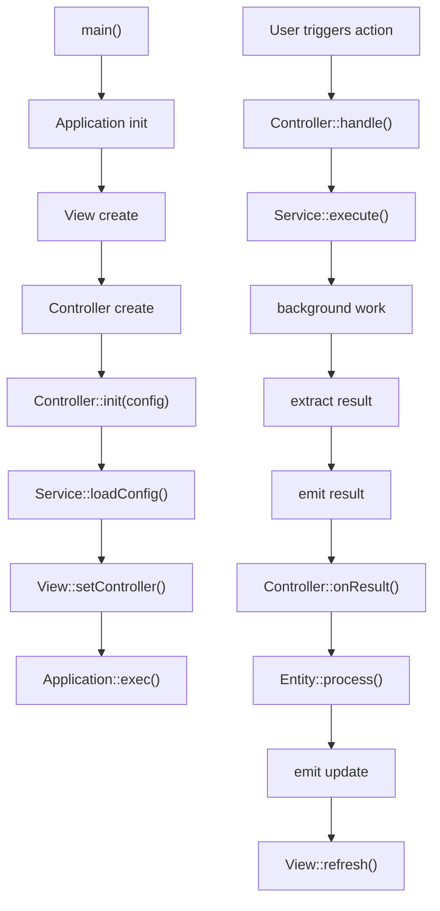
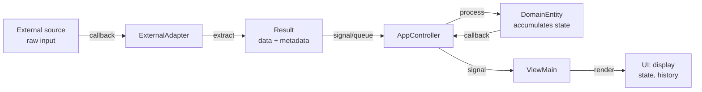

# C++ Architecture Diagram Generator

Analyze C++ source files in the current or specified directory and generate Mermaid diagrams describing the project's top-level architecture, class diagrams, key flowcharts, and data flow.

Supports any C++ project: GUI applications, libraries, plugin systems, CLI tools, and embedded systems.

## Invocation

When triggered with arguments, treat the argument as a directory path. When triggered without arguments, analyze the current working directory.

## Analysis Process

### Step 1: Discover Source Files and Project Structure

Scan the target directory recursively for `.h`, `.hpp`, `.hxx`, and `.cpp` files. Exclude build artifacts (`build/`, `cmake-build-*/`, `out/`, `.vscode/`, `autogen/`, `third_party/`, `external/`, `vendor/`, `moc_*`, `qrc_*`).

**Also scan `CMakeLists.txt` files** to identify:
- Project name and version
- Target types (executable, library, shared library)
- Source file groupings
- Dependency relationships between targets (`target_link_libraries`)
- Include directory structure (`target_include_directories`)

If CMake is present, prefer its target structure as the primary architectural signal.

### Step 2: Extract Architectural Information

For each header file, extract:

- **Class/struct/enum definitions**: `class X : public Y`, `struct X`, `enum class X`
- **Inheritance relationships**: `public`, `protected`, `private` inheritance (note: `struct` defaults to public, `class` to private)
- **Abstract/interface classes**: Classes with pure virtual methods (`= 0`)
- **Qt signals/slots**: `signals:`, `slots:`, `Q_OBJECT` macro
- **Composition**: `std::unique_ptr<T>`, `std::shared_ptr<T>` members
- **Aggregation**: Raw pointer members `T* member_` (excluding `void*`)
- **Dependencies**: `#include` statements referencing other project headers
- **Namespaces**: `namespace X { ... }`
- **Callbacks**: `std::function<...>`, `using ...Callback = ...`
- **Thread safety**: `std::atomic`, `std::mutex`, `std::lock_guard`, `std::thread`

Distinguish **forward declarations** (`class Foo;`) from actual definitions. Forward declarations indicate aggregation or compile-time dependency, not full coupling.

### Step 3: Identify Architectural Style

Before generating diagrams, classify the project's architecture by examining directory names, CMake targets, and include patterns:

| Style | Key Signals |
|-------|-------------|
| **Clean Architecture** | `presentation/`, `application/`, `domain/`, `infra/` directories; interface classes in domain layer |
| **MVC / MVP / MVVM** | `view/`, `controller/`, `model/` or `presenter/`, `viewmodel/` directories |
| **Library / SDK** | `include/` (public) + `src/` (internal); `add_library` in CMake; header-only patterns |
| **Plugin Architecture** | `plugins/` or `extensions/` directory; a `core/` or `host/` with plugin loading API |
| **Flat / Single-Layer** | No architectural subdirectories; single `src/` or flat layout; < 20 files |

Map detected directories to abstract layer labels accordingly:

#### Clean Architecture / Onion Architecture
| Directory Pattern | Layer Label |
|-------------------|-------------|
| presentation, ui, gui, view, window | Presentation Layer |
| application, app, usecase, controller, service | Application Layer |
| domain, entity, model, business | Domain Layer |
| infra, infrastructure, adapter, repository, external | Infrastructure Layer |

#### MVC / MVP / MVVM
| Directory Pattern | Layer Label |
|-------------------|-------------|
| view, ui, gui, window, qml | View Layer |
| controller, ctrl, presenter, viewmodel | Controller/Presenter Layer |
| model, entity, domain | Model Layer |
| service, svc, api, repository | Service Layer |

#### Library / SDK Layout
| Directory Pattern | Layer Label |
|-------------------|-------------|
| include, public, api | Public API |
| src, src/core, src/internal | Internal Implementation |
| src/detail, impl, private | Private/Detail |

#### Plugin Architecture
| Directory Pattern | Layer Label |
|-------------------|-------------|
| plugins, extensions, modules | Plugin Layer |
| core, host, engine, runtime | Core/Host Layer |
| sdk, api | SDK/API Layer |

#### Flat / Single-Layer (small projects)
When no architectural directories exist, use namespace or class hierarchy as the grouping mechanism. Label as a single "Application" layer with subgroups by module or namespace.

**Fallback:** If none of the above patterns match, use top-level directory names as-is and label them as `Component: dirname/`.

### Step 4: Generate Mermaid Diagrams

Generate the appropriate diagrams based on project type and size (see Step 4.5 and 4.6). Output as markdown code blocks.

#### 4.1 Top-Level Architecture Diagram

Use `graph TD` (top-down) showing subgraphs for each architectural layer, components within layers, and labeled dependency arrows between layers.

**Example — Clean Architecture / Layered:**



**Example — Library / SDK Layout:**



**Example — Plugin Architecture:**



#### 4.2 Class Diagram

Use Mermaid `classDiagram` showing classes with key methods/members, inheritance (`<|--`), composition (`*--`), aggregation (`o--`), and dependencies (`..>`).



#### 4.3 Key Flowchart

Use `flowchart TD` for critical execution flows. Identify flows by looking at `main()` entry points, event handlers, and callback chains:

- **Initialization flow**: Application startup, config loading, component creation
- **Processing flow**: Main loop, event handling, data processing pipelines
- **Lifecycle flow**: Start, pause, resume, stop, cleanup



#### 4.4 Data Flow Diagram

Use `graph LR` (left-right) showing how data moves through the system:



#### 4.5 Diagram Selection Guidelines

Not every project needs all four diagram types. Use this decision tree:

| Project Type | Architecture | Class Diagram | Flowchart | Data Flow |
|-------------|:---:|:---:|:---:|:---:|
| GUI application | YES | YES | YES | YES |
| Clean Architecture app | YES | YES | Conditional | Conditional |
| Header-only library | NO | YES | NO | NO |
| Static/shared library | NO | YES | NO | Conditional |
| CLI tool (< 20 files) | NO | YES | YES | NO |
| Plugin-based system | YES | Partial | Conditional | YES |
| Pure data/model project | NO | YES | NO | YES |

**When to skip Top-Level Architecture diagram:**
- Project has fewer than 10 source files
- Flat directory structure with no logical layers
- Single-purpose utility library

**When to skip Flowchart:**
- Library with no clear entry point
- Event-driven system with no linear flow
- Header-only template library

**When to skip Data Flow:**
- Library that does not transform or pass data between components
- Configuration-only project

#### 4.6 Project Size Scaling

**Small projects (< 20 files):**
- Include all classes in diagrams
- Use full method signatures in class diagrams
- All four diagram types are usually overkill; pick 1-2 most relevant

**Medium projects (20-100 files):**
- Include only public API classes and layer-boundary classes in architecture diagram
- Abbreviate method signatures to 3-5 key methods per class
- Group implementation-detail classes into subgraphs

**Large projects (100+ files):**
- Do NOT attempt to diagram every class
- Identify the 10-20 most architecturally significant classes:
  - Public API entry points
  - Interface/abstract base classes
  - Classes at layer boundaries
  - Classes with the most incoming/outgoing dependencies
- Use subgraphs to group classes by directory or namespace
- Consider generating separate diagrams per subsystem on request

### Step 5: Identify Design Patterns

Look for these patterns and list those found with the specific classes involved:

**Creational**: Factory Method, Abstract Factory, Builder, Singleton, Dependency Injection

**Structural**: Adapter, Bridge, Composite, Decorator, Facade, PIMPL (opaque pointer), Proxy

**Behavioral**: Observer, Strategy, Command, State, Template Method, Iterator, Callback/Delegate

**Concurrency**: Active Object, Reactor, Producer-Consumer, Thread Pool

**Architectural**: MVC, MVP, MVVM, Clean Architecture, Layered, Hexagonal/Ports-and-Adapters, Plugin, Microkernel

For each pattern found, note how it manifests (e.g., "Observer pattern: Controller uses Qt signals; Domain uses std::function callbacks").

## Output Format

After analysis, produce output in the following structure. Use `{ProjectName}` from CMake `project(...)` or the target directory name:

```markdown
## Project Architecture Analysis: {ProjectName}

### Source Files

| Layer | Files |
|-------|-------|
| ... | ... |

### Top-Level Architecture

```mermaid
...
```

### Class Diagram

```mermaid
...
```

### Key Flows

#### Initialization Flow

```mermaid
...
```

#### Processing Flow

```mermaid
...
```

### Data Flow

```mermaid
...
```

### Design Patterns Identified

- List observed patterns with participating classes
- Thread safety mechanisms
- Error handling approach
```

## Analysis Heuristics

### Class Relationship Detection

| Pattern | Relationship |
|---------|-------------|
| `class A : public B` | Inheritance |
| `struct A : public B` | Inheritance |
| `std::unique_ptr<B> b_;` | Composition (ownership) |
| `std::shared_ptr<B> b_;` | Shared ownership |
| `B* b_;` (with forward decl) | Aggregation (non-owning) |
| `#include "B.h"` + method calls | Dependency |
| `signals:` / `slots:` (Qt) | Observer / Signal-Slot |
| `std::function<void(T)>` | Callback |
| `class A { virtual T foo() = 0; }` | Abstract class / Interface |

### Thread Safety Detection

| Pattern | Meaning |
|---------|---------|
| `std::atomic<T>` | Lock-free thread safety |
| `std::mutex` + `std::lock_guard` | Mutex-protected sections |
| `std::thread` | Background thread |
| `Qt::QueuedConnection` | Cross-thread signal routing |

## Script Usage

The bundled script `scripts/analyze_cpp.sh` can be used for automated file scanning:

```bash
bash scripts/analyze_cpp.sh <directory>
```

It outputs a structured text summary (markdown-formatted) of classes, composition relationships, thread safety markers, callback patterns, include relationships, and CMake targets. The agent should parse this output and use it to populate the Mermaid diagrams.

## Additional Resources

### Script Files

- **`scripts/analyze_cpp.sh`** - Automated C++ source file scanner
